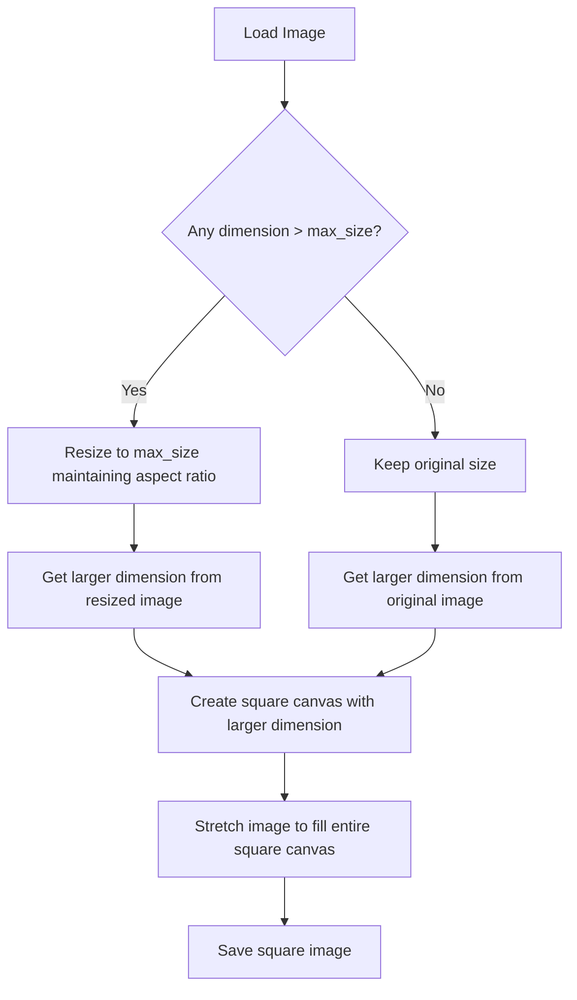
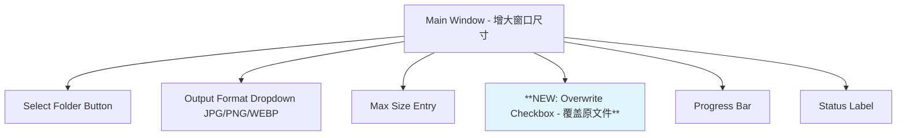

# Image Resizer Enhancement Plan - 增强版图片处理器计划

## 📋 Requirements Summary (需求总结)

Based on the new requirements, we need to implement three major enhancements:

1. **正方形输出 (Square Output)**: 所有输出图片都要是正方形
   - 如果图片大于max_size，先按比例resize再stretch成正方形
   - 如果图片小于max_size，直接stretch成正方形
   - 允许图片变形以确保输出为正方形

2. **PNG透明通道处理 (PNG Transparency Handling)**: 
   - PNG转JPG时透明部分变成白色背景
   - 使用业界最佳实践避免黑色背景问题

3. **覆盖选项 (Overwrite Option)**: 
   - 添加checkbox控制是否覆盖原文件
   - 当不覆盖时，在当前文件夹创建子文件夹存放输出图片

---

## 🏗️ Technical Implementation Plan (技术实现计划)

### 1. Square Output Logic (正方形输出逻辑)



**实现步骤:**
1. 检查图片是否超过max_size，如果是则先等比例缩放
2. 取缩放后（或原始）图片的较大尺寸作为正方形边长
3. 创建正方形画布
4. 将图片拉伸填充整个正方形（可能产生变形）

### 2. PNG Transparency Handling (PNG透明通道处理)

**Current Issue (当前问题):**
```python
# 现有代码 - 会产生黑色背景
if pil_format == "JPEG" and img.mode in ("RGBA", "LA"):
    img = img.convert("RGB")  # 直接转换产生黑色背景
```

**Enhanced Solution (改进方案):**
```python
def handle_transparency(img, pil_format, background_color=(255, 255, 255)):
    """Handle transparency when converting to formats that don't support it"""
    if pil_format == "JPEG" and img.mode in ("RGBA", "LA"):
        # 创建指定颜色的背景
        background = Image.new('RGB', img.size, background_color)
        if img.mode == "RGBA":
            background.paste(img, mask=img.split()[-1])  # 使用alpha通道作为mask
        elif img.mode == "LA":
            background.paste(img, mask=img.split()[-1])  # 使用alpha通道作为mask
        return background
    return img
```

**Best Practices (最佳实践):**
- 白色背景 (255, 255, 255) 是最常用和安全的选择
- 使用alpha通道作为mask确保正确的边缘处理
- 支持RGBA和LA (Luminance + Alpha) 模式

### 3. UI Enhancements (UI增强)

**新增控件:**



**UI Layout Changes:**
- 窗口高度增加约30-40px适应新控件
- Overwrite checkbox 位置在 Max Size Entry 和 Progress Bar 之间
- 默认状态：选中（保持现有行为）

### 4. File Output Strategy (文件输出策略)

#### When Overwrite is Enabled (覆盖模式 - 默认):
- 行为与现在完全相同
- 覆盖原文件，更新文件扩展名

#### When Overwrite is Disabled (非覆盖模式):
- 在当前文件夹创建子文件夹: `resized_images_square`
- 输出文件保持原文件名，仅更改扩展名
- 例如: `/原文件夹/photo.png` → `/原文件夹/resized_images_square/photo.jpg`

**子文件夹命名逻辑:**
```python
def get_output_folder_name():
    return "resized_images_square"
```

---

## 🔧 Code Implementation Details (代码实现细节)

### Core Changes in `image_resizer.py`

#### 1. UI Updates (lines 14-80)
```python
# 新增变量
self.overwrite_var = tk.BooleanVar(value=True)  # 默认覆盖

# 在setup_ui()中添加
overwrite_checkbox = ttk.Checkbutton(
    controls_frame,
    text="覆盖原文件 (Overwrite original files)",
    variable=self.overwrite_var
)
```

#### 2. Square Resize Logic (重写 resize_image 方法)
```python
def resize_image_square(self, image_path, output_format, format_ext_map, pil_format_map, max_size):
    with Image.open(image_path) as img:
        # Step 1: 如果超过max_size先缩放
        width, height = img.size
        if width > max_size or height > max_size:
            # 按比例缩放到max_size以内
            if width > height:
                new_width = max_size
                new_height = int(max_size * height / width)
            else:
                new_height = max_size
                new_width = int(max_size * width / height)
            img = img.resize((new_width, new_height), Image.Resampling.LANCZOS)
            width, height = new_width, new_height
        
        # Step 2: 创建正方形
        square_size = max(width, height)
        
        # Step 3: 拉伸到正方形 (可能变形)
        square_img = img.resize((square_size, square_size), Image.Resampling.LANCZOS)
        
        # Step 4: 保存
        self.save_with_format(square_img, image_path, output_format, format_ext_map, pil_format_map)
```

#### 3. Enhanced Transparency Handling
```python
def handle_transparency(self, img, pil_format):
    if pil_format == "JPEG" and img.mode in ("RGBA", "LA"):
        # 创建白色背景
        background = Image.new('RGB', img.size, (255, 255, 255))
        if img.mode == "RGBA":
            background.paste(img, mask=img.split()[-1])
        elif img.mode == "LA":
            background.paste(img, mask=img.split()[-1])
        return background
    return img
```

#### 4. Output Path Logic
```python
def get_output_path(self, orig_path, output_format, format_ext_map):
    dir_name = os.path.dirname(orig_path)
    base_name = os.path.splitext(os.path.basename(orig_path))[0]
    new_ext = format_ext_map[output_format]
    
    if self.overwrite_var.get():
        # 覆盖模式：在原位置
        return os.path.join(dir_name, base_name + new_ext)
    else:
        # 非覆盖模式：创建子文件夹
        output_dir = os.path.join(dir_name, "resized_images_square")
        os.makedirs(output_dir, exist_ok=True)
        return os.path.join(output_dir, base_name + new_ext)
```

---

## 🧪 Testing Scenarios (测试场景)

### Image Size Test Cases:
1. **大图片**: 3000x2000 → resize到1000x667 → square到1000x1000
2. **小图片**: 800x600 → 直接square到800x800
3. **正方形图片**: 500x500 → 保持500x500
4. **极端长宽比**: 2000x500 → resize到1000x250 → square到1000x1000

### Transparency Test Cases:
1. **RGBA PNG** → JPG with white background
2. **LA PNG** → JPG with white background  
3. **RGB PNG** → JPG (no transparency issues)

### File Output Test Cases:
1. **覆盖模式**: photo.png → photo.jpg (替换原文件)
2. **非覆盖模式**: photo.png → resized_images_square/photo.jpg

### Format Conversion Test Cases:
1. PNG → JPG
2. PNG → PNG  
3. JPG → WEBP
4. WEBP → JPG

---

## 📊 Performance Considerations (性能考虑)

1. **内存优化**: 使用with语句确保图片及时释放内存
2. **批处理效率**: 保持单线程处理避免UI冻结
3. **错误处理**: 加强异常处理，单个文件失败不影响整体处理
4. **进度反馈**: 详细的状态更新让用户了解处理进度

---

## 🎯 Implementation Priority (实现优先级)

1. **High Priority**: Square output logic (核心功能)
2. **High Priority**: Transparency handling (修复existing bug)
3. **Medium Priority**: UI enhancements (用户体验)
4. **Medium Priority**: Output folder logic (新功能)
5. **Low Priority**: Error handling improvements (稳定性)

---

This plan provides a comprehensive roadmap for implementing all requested features while maintaining code quality and user experience. Ready to proceed with implementation?