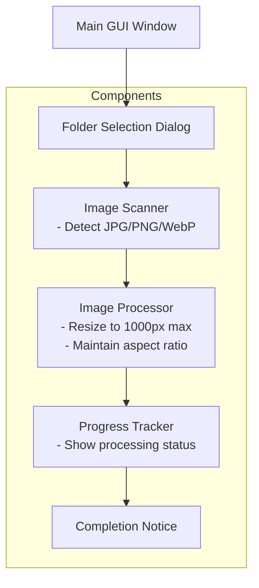

# Image Resizer Tool - Implementation Plan

## 1. Architecture Overview

## 2. Technical Stack
- **Language**: Python 3.x
- **Key Libraries**:
  - `tkinter` - GUI framework
  - `Pillow` (PIL) - Image processing
  - `PyInstaller` - EXE creation

## 3. Component Details

### 3.1 GUI Interface
- Simple window with:
  - "Select Folder" button
  - Progress bar
  - Status label
- Uses `tkinter.filedialog` for folder selection

### 3.2 Image Scanner
- Scans selected directory (top-level only)
- Filters for supported formats (.jpg, .jpeg, .png, .webp)
- Returns list of valid image paths

### 3.3 Image Processor
- Takes image path list
- For each image:
  1. Opens with PIL
  2. Calculates new dimensions maintaining aspect ratio
  3. Performs resize operation
  4. Saves back to original location
  - Handles errors gracefully

### 3.4 Progress Tracking
- Shows progress bar during processing
- Updates status text for current operation
- Displays final completion message

## 4. Implementation Steps

1. **Setup Project Structure**
   - Create main script `image_resizer.py`
   - Set up virtual environment
   - Install required packages

2. **Create GUI Interface**
   - Implement main window
   - Add folder selection
   - Create progress display

3. **Implement Core Logic**
   - Image scanning functionality
   - Resize operation handler
   - Error handling

4. **Add Progress Tracking**
   - Progress bar updates
   - Status messages
   - Completion notification

5. **Package as EXE**
   - Create PyInstaller spec
   - Bundle dependencies
   - Generate standalone executable

## 5. Error Handling
- Invalid image files
- Read/write permission issues
- Insufficient disk space
- Corrupted images

## 6. Testing Plan
1. Test with various image formats
2. Test with different folder structures
3. Test with different image sizes
4. Verify aspect ratio maintenance
5. Test error scenarios