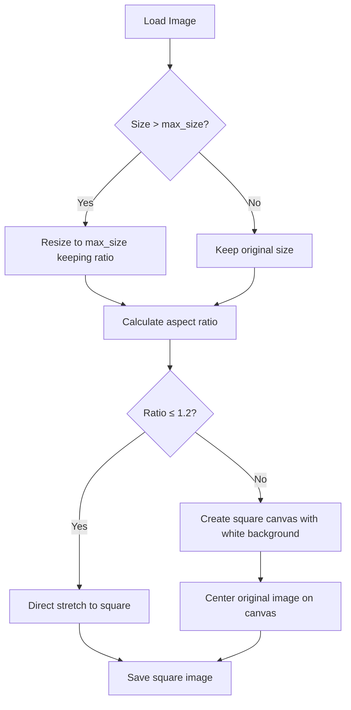

# 智能正方形输出策略 - Smart Square Output Strategy

## 📋 Updated Requirements (更新需求)

基于用户反馈，我们需要实现一个更智能的正方形输出策略：

1. **智能拉伸vs填充决策**:
   - 长宽比 ≤ 1.2:1 : 直接拉伸成正方形（变形较小）
   - 长宽比 > 1.2:1 : 白色填充居中（保持原图比例）

2. **保持现有功能**:
   - PNG透明通道处理（白色背景）
   - 覆盖选项控制
   - 支持各种图片格式

---

## 🧠 Smart Square Logic (智能正方形逻辑)



## 💡 Implementation Strategy (实现策略)

### 核心算法 Core Algorithm:

```python
def create_smart_square(img, square_size):
    width, height = img.size
    aspect_ratio = max(width, height) / min(width, height)
    
    if aspect_ratio <= 1.2:
        # 轻微差距：直接拉伸
        return img.resize((square_size, square_size), Image.Resampling.LANCZOS)
    else:
        # 较大差距：白色填充居中
        square_canvas = Image.new('RGB', (square_size, square_size), (255, 255, 255))
        
        # 计算居中位置
        paste_x = (square_size - width) // 2
        paste_y = (square_size - height) // 2
        
        # 将原图粘贴到中心
        if img.mode == 'RGBA':
            square_canvas.paste(img, (paste_x, paste_y), img)
        else:
            square_canvas.paste(img, (paste_x, paste_y))
        
        return square_canvas
```

### 处理流程 Process Flow:

1. **Step 1**: 检查是否需要resize到max_size以内
2. **Step 2**: 计算目标正方形尺寸（取较大边）
3. **Step 3**: 判断长宽比是否≤1.2
4. **Step 4a**: 如果≤1.2，直接拉伸
5. **Step 4b**: 如果>1.2，创建白色画布并居中放置
6. **Step 5**: 处理透明通道和保存

---

## 🎯 Benefits (优势)

1. **视觉质量**：避免严重变形，保持图片美观
2. **智能决策**：自动选择最佳的正方形策略
3. **用户友好**：无需用户手动选择，算法自动处理
4. **兼容性**：支持透明图片的正确填充

---

## 🧪 Test Cases (测试用例)

### 拉伸场景 (Stretch Cases):
- 800x600 → ratio=1.33 > 1.2 → 白色填充
- 1000x900 → ratio=1.11 ≤ 1.2 → 直接拉伸
- 500x500 → ratio=1.0 ≤ 1.2 → 直接拉伸

### 填充场景 (Padding Cases):
- 1000x400 → ratio=2.5 > 1.2 → 白色填充居中
- 300x800 → ratio=2.67 > 1.2 → 白色填充居中
- 2000x800 → 先resize → 1000x400 → 白色填充

### 透明图片 (Transparent Images):
- RGBA PNG with ratio > 1.2 → 白色背景填充，保持透明效果
- RGBA PNG with ratio ≤ 1.2 → 拉伸后处理透明背景

---

Ready to implement this smart strategy!